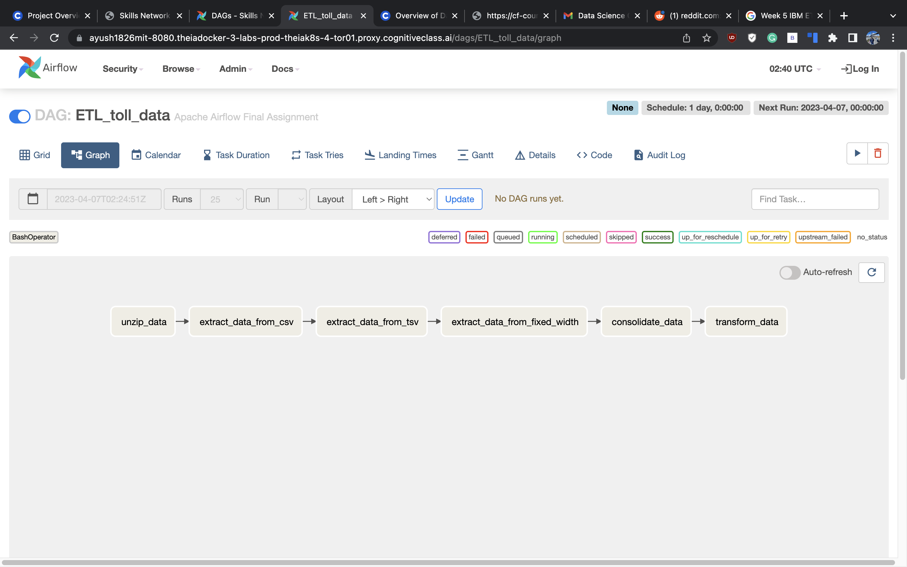

# Project Overview
You have been assigned to a project that aims to de-congest the national highways by analyzing the road traffic data from different toll plazas. Each highway is operated by a different toll operator with different IT setup that use different file formats.  In the first Hands-on lab your job is to collect data available in different formats and, consolidate it into a single file.  
As a vehicle passes a toll plaza, the vehicle's data like vehicle_id,vehicle_type,toll_plaza_id and timestamp are streamed to Kafka. In the second Hands-on lab your job is to create a data pipe line that collects the streaming data and loads it into a database.

## Objectives
### In this assignment you will author an Apache Airflow DAG that will:

* Extract data from a csv file
* Extract data from a tsv file
* Extract data from a fixed width file
* Transform the data
* Load the transformed data into the staging area

# STEPS :

## EXCERCISE 1 - Prepare the lab environment
1. Start Apache Airflow  https://ayush1826mit-8080.theiadocker-3-labs-prod-theiak8s-4-tor01.proxy.cognitiveclass.ai/home
2. Open a terminal and create a directory structure for staging area as follows:
      * sudo mkdir -p /home/project/airflow/dags/finalassignment/staging
3. Download the dataset from the source to the destination mentioned below using wget command.
      * https://cf-courses-data.s3.us.cloud-object-storage.appdomain.cloud/IBM-DB0250EN-SkillsNetwork/labs/Final%20Assignment/tolldata.tgz
      * Destination : /home/project/airflow/dags/finalassignment
4. Change to the staging directory.
      * cd /home/project/airflow/dags/finalassignment/staging
    
## EXCERCISE 2 - Create a DAG
### TASK 1.1 - Define the DAG arguments as per the following details:

| Parameter         | Value                           |
|-------------------|---------------------------------|
| owner             | < You may use any dummy name>   |
| start_date        | today                           |
| email             | < You may use any dummy email>  |
| email_on_failure  | True                            |
| email_on_retry    | True                            |
| retries           | 1                               |
| retry_delay       | 5 minutes                       |

## Define the DAG
### Task 1.2 - Create a DAG as per the following details.

| Parameter    | Value                                              |
|--------------|----------------------------------------------------|
| DAG id       | ETL_toll_data                                      |
| Schedule     | Daily once                                         |
| default_args | as you have defined in the previous step           |
| description  | Apache Airflow Final Assignment                    |

### Task 1.3 - Create a task to unzip data
Create a task named unzip_data. Use the downloaded data from the url given in the first part of this assignment in exercise 1 and uncompress it into the destination directory.

### Task 1.4 - Create a task to extract data from csv file
Create a task named extract_data_from_csv. This task should extract the fields Rowid, Timestamp, Anonymized Vehicle number, and Vehicle type from the vehicle-data.csv file and save them into a file named csv_data.csv

### Task 1.5 - Create a task to extract data from tsv file
Create a task named extract_data_from_tsv. This task should extract the fields Number of axles, Tollplaza id, and Tollplaza code from the tollplaza-data.tsv file and save it into a file named tsv_data.csv.

### Task 1.6 - Create a task to extract data from fixed width file
Create a task named extract_data_from_fixed_width. This task should extract the fields Type of Payment code, and Vehicle Code from the fixed width file payment-data.txt and save it into a file named fixed_width_data.csv.

### Task 1.7 - Create a task to consolidate data extracted from previous tasks
Create a task named consolidate_data. This task should create a single csv file named extracted_data.csv by combining data from the following files:

* csv_data.csv
* tsv_data.csv
* fixed_width_data.csv
The final csv file should use the fields in the order given below:
* Rowid, Timestamp, Anonymized Vehicle number, Vehicle type, Number of axles, Tollplaza id, Tollplaza code, Type of Payment code, and Vehicle Code

*Hint: Use the bash paste command*
paste command merges lines of files.
Example : paste file1 file2 > newfile
The above command merges the columns of the files file1 and file2 and sends the output to newfile.
You can use the command man paste to explore more

### Task 1.8 - Transform and load the data
Create a task named transform_data. This task should transform the vehicle_type field in extracted_data.csv into capital letters and save it into a file named transformed_data.csv in the staging directory.

### Task 1.9 - Define the task pipeline

| Task | Functionality |
| --- | --- |
| First task | unzip_data |
| Second task | extract_data_from_csv |
| Third task | extract_data_from_tsv |
| Fourth task | extract_data_from_fixed_width |
| Fifth task | consolidate_data |
| Sixth task | transform_data |

### Task 1.10 - Submit the DAG

### Task 1.11 - Monitor the DAG